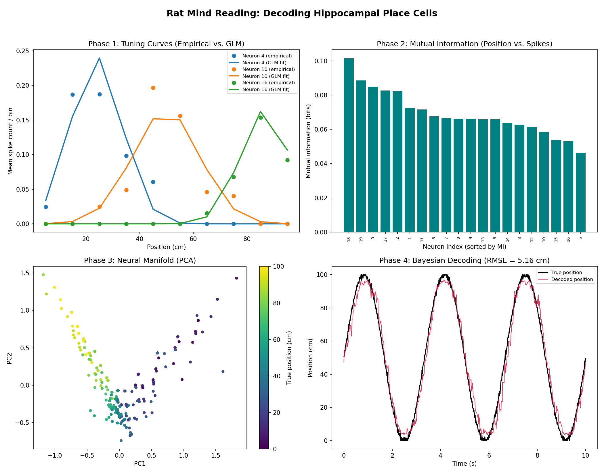

# 🧭 Neural GPS

### Decoding a rat's position from simulated hippocampal place cells

*A computational neuroscience pipeline that reconstructs an animal's location in space,*
*using nothing but the firing patterns of its "place cells" — the brain's built-in GPS.*


---

## 🧠 The Big Idea

In 2014, the Nobel Prize in Physiology or Medicine recognized discoveries of the brain's spatial navigation system, including **place cells** in the hippocampus — neurons that fire preferentially when an animal occupies particular locations. Together, they help form an internal representation of space.


Neural GPS asks the reverse question:

    If we can watch these neurons fire, can we work backwards and figure out where the animal is?

The answer is yes. This project simulates a rat exploring a 1-D track, generates biologically plausible neural activity, and then decodes the rat's position from spikes alone — achieving a reconstruction error of just 5.16 cm.

---

### 📖 Comprehensive Technical Reports
For a deeper mathematical understanding of the encoding models (GLM), information theory, PCA manifold discovery, and Bayesian decoding implemented in this project, please refer to our detailed academic reports available in both English and Persian:

- 📄 **[Technical Report (English Version)](ReportEN.pdf)**
- 📄 **[Technical Report (Persian Version)](ReportFA.pdf)**


---

## 📊 Results at a Glance

<div align="center">
  
</div>

The pipeline produces four complementary views of the same neural code:


| Panel | 📊 What It Shows | 💡 Key Takeaway |
|-------|------------------|-----------------|
| **1️⃣ Tuning Curves** | Firing rate of each place cell vs. position | Each neuron acts as a *"spotlight"* for one location  |
| **2️⃣ Mutual Information** | Bits of positional info carried per cell | Cells with sharper tuning are **more informative**  |
| **3️⃣ PCA Manifold** | Population activity projected to 2-D | Neural states trace a smooth ring — a *low-dimensional map* of space  |
| **4️⃣ Bayesian Decoding** | True vs. decoded position | Decoder tracks the real trajectory with **`RMSE ≈ 5.16 cm`**  |

> 💡 **The key insight:** high-dimensional spiking activity collapses onto a simple, 
> continuous manifold that *mirrors the geometry of the physical world* the animal moves through.

---

## ⚙️ How It Works — Four Phases

### Phase 1 — Simulating Place Cells
Each of the $N$ place cells is modeled with a **Gaussian tuning curve**. A neuron with its 
place field centered at $\mu_i$ fires with expected rate:

$$
\lambda_i(x) = r_{\max} \cdot \exp\!\left( -\frac{(x - \mu_i)^2}{2\sigma^2} \right) + r_{\text{base}}
$$

Spike counts in each time bin are drawn from a **Poisson process**, capturing the 
trial-to-trial variability seen in real neurons:

$$
n_i \sim \text{Poisson}\big(\lambda_i(x)\,\Delta t\big)
$$

### Phase 2 — Quantifying the Code (Mutual Information)
How much does each cell actually *tell us* about position? We measure this with 
**mutual information** between stimulus $X$ and neural response $R$:

$$
I(X; R) = \sum_{x}\sum_{r} p(x, r)\,\log_2 \frac{p(x, r)}{p(x)\,p(r)}
$$

Cells with narrow, well-placed fields score higher — they resolve the animal's location 
more precisely.

### Phase 3 — Finding the Neural Manifold (PCA)
The population response lives in an $N$-dimensional space, but the *behavior* it encodes 
is only 1-D (position on the track). Applying **Principal Component Analysis** reveals that 
the neural states lie on a smooth, low-dimensional manifold — a ring — that recovers the 
underlying structure of the environment without ever being told about position.

### Phase 4 — Reading the Mind (Bayesian Decoding)
Finally, we invert the encoding model. Given an observed spike vector $\mathbf{n}$, 
**Bayes' rule** gives the posterior probability over positions:

$$
P(x \mid \mathbf{n}) \propto P(\mathbf{n} \mid x)\,P(x)
$$

Assuming conditionally independent Poisson firing, the log-likelihood (computed in 
**log-space for numerical stability**) is:

$$
\log P(\mathbf{n} \mid x) = \sum_{i=1}^{N} \Big[ n_i \log\big(\lambda_i(x)\Delta t\big) - \lambda_i(x)\Delta t \Big] + \text{const}
$$

The decoded position is the maximum of the posterior, $\hat{x} = \arg\max_x P(x \mid \mathbf{n})$, 
which recovers the true trajectory to within a few centimeters.

---

## 🚀 Quick Start
```bash
# Clone the repo
git clone https://github.com/alitkbbl/neural-gps.git
cd neural-gps

# Install dependencies
pip install -r requirements.txt

# Run the full pipeline
python neural_gps.py
```
The script runs end-to-end and saves the results figure as `neural_gps_results.png`.

